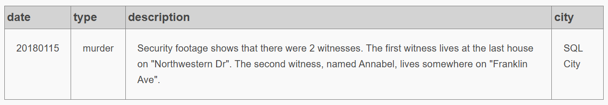

# SQL-Murder-Mystery-Solution

Solve a fictional murder by querying a structured database using SQL.
This challenge is based on the interactive ["SQL Murder Mystery"](https://mystery.knightlab.com/) from Northwestern University’s Knight Lab.

## 1. Project Overview
In this project, the crime is solved by using SQL to investigate a series of clues stored across multiple tables (people, interviews, drivers licenses, events, etc.). The goal is to correctly identify the culprit by analyzing data logically and sequentially. All the queries are in a `.sql` file and their respective results are located in `/results` folder.

## 2. Project Structure
```
.
├── 01_crime_scene_report.sql
├── 02_witness_statements.sql
├── 03_suspect_identification.sql
├── 04_combined_witness_info.sql
├── 05_culprit_interview.sql
├── 06_woman_car_license.sql
├── 07_new_suspects.sql
├── 08_event_attendance.sql
├── 09_person_details.sql
├── results/
│   ├── 01_crime_scene_report.png
│   ├── 02_witness_statements.png
│   ├── 03_suspect_identification.png
│   ├── 04_combined_witness_info.png
│   ├── 05_culprit_interview.png
│   ├── 06_woman_car_license.png
│   ├── 07_new_suspects.png
│   ├── 08_event_attendance.png
│   ├── 09_person_details.png
└── README.md
```

## 3. Investigation Flow
The process follows a logical sequence:

1. Crime Scene Report – Narrow down the date/location of the crime.
2. Witness Interviews – Collect witness statements for clues.
3. Suspect Identification – Use clues (e.g. gym memberships, car models) to filter suspects.
4. Cross-checking Info – Combine data from both witnesses.
5. Interviewing Suspects – Identify behavior/inconsistencies.
6. Final Suspect Confirmation – Confirm the killer and their motivations.

Each .sql file represents a step in this investigation.

## 4. Query Explanations

| File Name                       | Purpose                                    | Contents                                                                                      |
| ------------------------------- | ------------------------------------------ | --------------------------------------------------------------------------------------------- |
| `01_crime_scene_report.sql`     | Initial crime scene info                   | Filters for the specific crime based on type, date, and city.                                 |
| `02_witness_statements.sql`     | Witness interviews                         | Queries pulling witness 1 and 2’s statements to gather information.                           |
| `03_suspect_identification.sql` | Suspect filtering from witness info        | Filters  suspects based on gym members and driver license data from previous clues.           |
| `04_combined_witness_info.sql`  | Combining info from multiple witnesses     | INTERSECT queries & optimized with JOIN query combining witness info to narrow down the list. |
| `05_culprit_interview.sql`      | Interview of main suspect                  | Reviews the interview of the main suspect to find inconsistencies.                            |
| `06_woman_car_license.sql`      | Identify female suspect by car and license | Identifies a female suspect matching car and license descriptions.                            |
| `07_new_suspects.sql`           | Additional suspects based on licenses      | Expands the list of suspects using new clues.                                                 |
| `08_event_attendance.sql`       | Checking suspects' event attendance        | Query counting event attendance for suspects mentioned in interviews.                         |
| `09_person_details.sql`         | Fetch details for a specific person        | Final detail lookup of the identified person by ID.                                           |

### 01_crime_scene_report.sql

* **Purpose**: Find initial crime details to narrow down the time and location.

* **Query Summary**:
This query filters the `crime_scene_report` table for a murder that occurred in SQL City in January 2018.

* **Query File**: [`01_crime_scene_report.sql`](01_crime_scene_report.sql)

* **Result**: [`results/01_crime_scene_report.png`](results/01_crime_scene_report.png)



